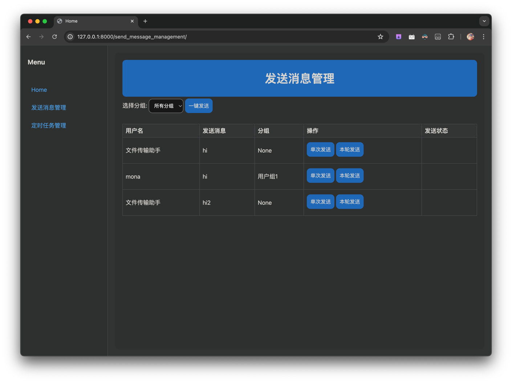
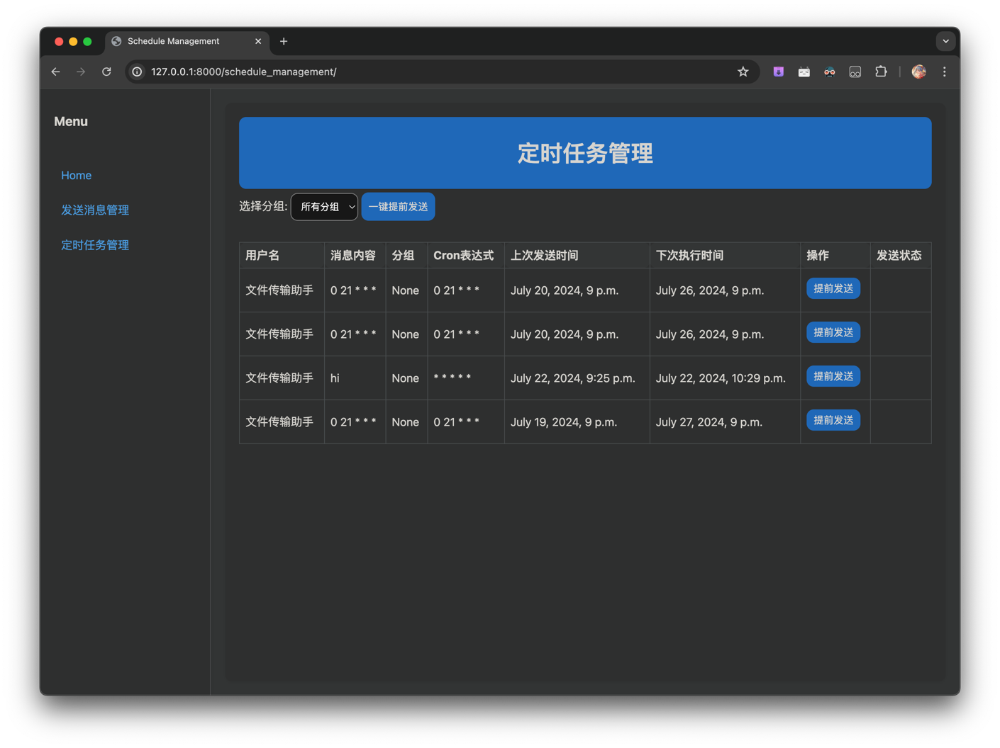
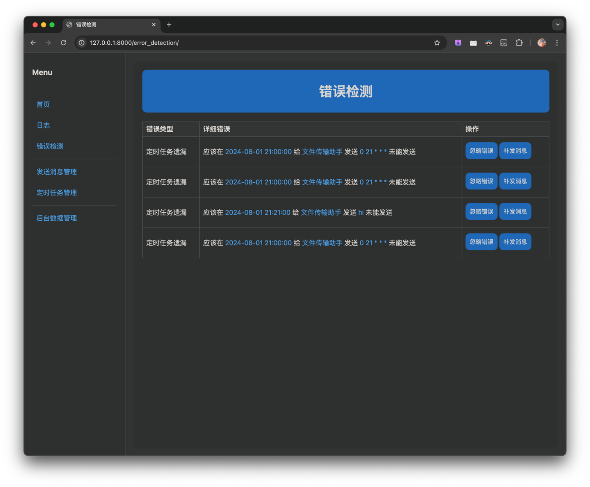
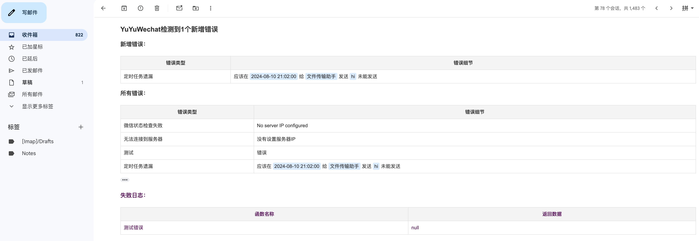
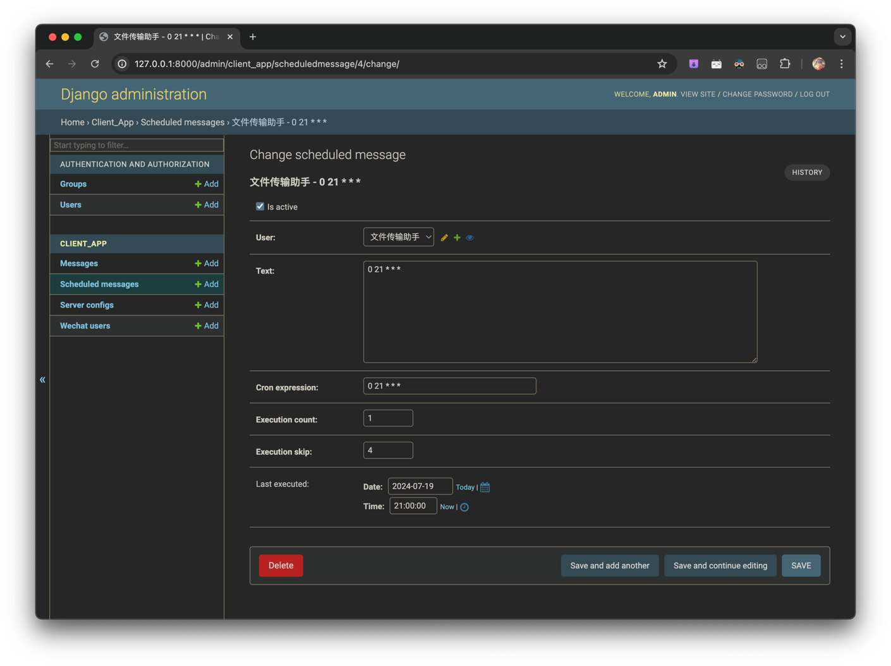
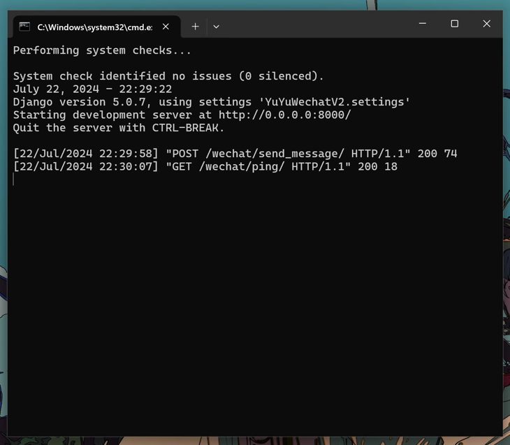
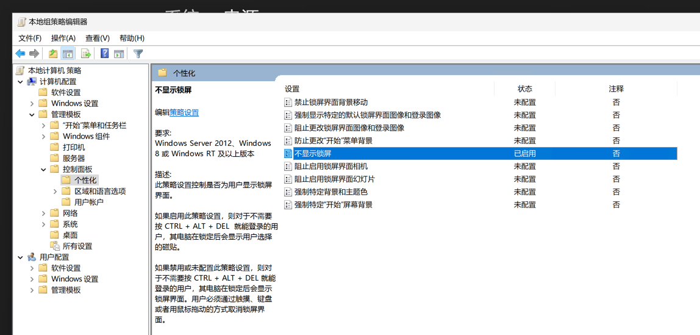
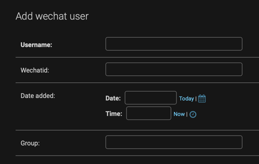
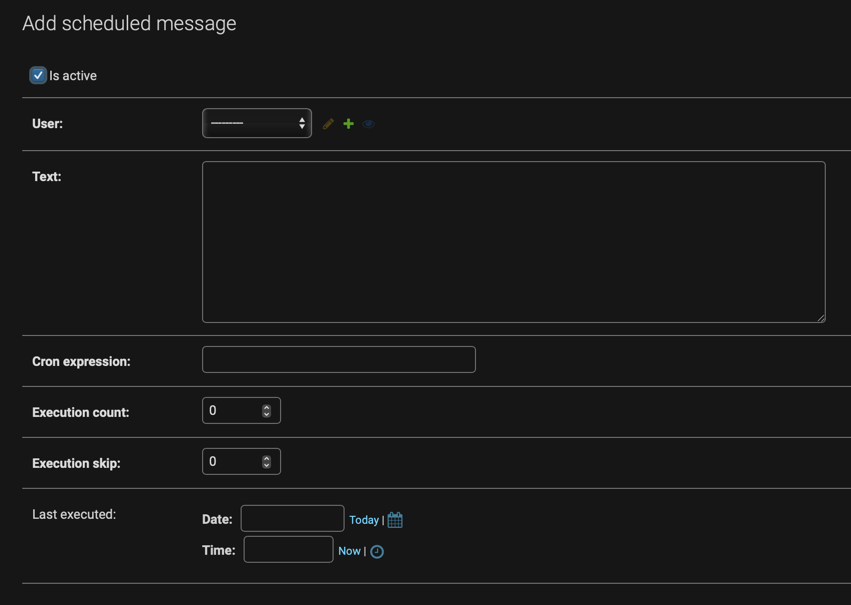
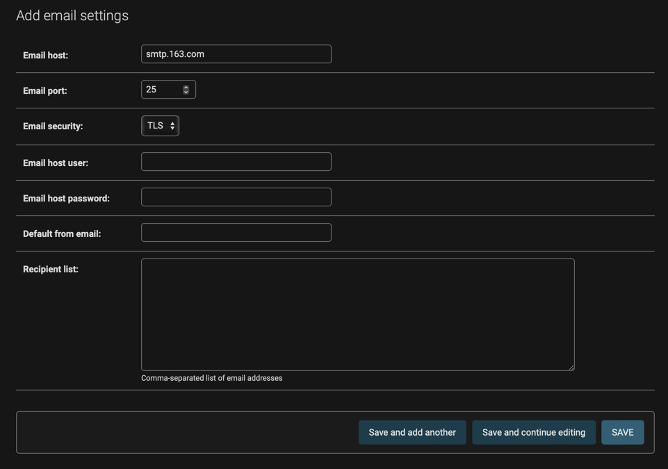

<h1 align="center"> 🌧️YuYuWechat</h1>

一个让微信定时循环发送消息（使用cron表达式任务可以精确到分钟），批量群发消息的小工具🚀，并且提供了一个简易直观的界面，可部署到任意平台


<h6 align="center">首页管理界面，在这里，可以概览系统的所有功能


<h6 align="center">登录保护，保证数据安全性


<h6 align="center">批量发送消息


<h6 align="center">定时发送消息


<h6 align="center">错误检测


<h6 align="center">自动检测错误，并且通过邮件报警，及时处理错误


<h6 align="center">后台管理界面，对消息数据进行增删改。


# 📋 目录

- [✨功能特点](#功能特点)
- [1. 介绍](#1-介绍)
  - [YuYuWechatV2_Server服务端](#yuyuwechatv2_server服务端)
  - [YuYuWechatV2_Client客户端](#yuyuwechatv2_client客户端)
- [2. 部署服务端](#2-部署服务端)
- [3. 部署客户端](#3-部署客户端)
- [4. 额外功能](#4-额外功能)
  - [邮件报警](#邮件报警)
- [5. 可靠性](#5-可靠性)
  - [错误检测](#错误检测)
  - [自动化测试](#自动化测试)
- [6. 感谢](#6-感谢)
- [7. 其他](#7-其他)

# ✨功能特点

✅群发消息：一次性向多个好友发送不同的消息👥

✅自动发送消息：自动检查时间并在对应时刻发送消息🤖（基于cron表达式，可精确到分钟）

✅循环发送消息：cron表达式可设置任意循环作业🔄

✅可靠性保证：日志记录以及自动错误检测，可保证定时任务不遗漏执行🔍

✅登录认证保护：登录保护，保证数据安全性🔒

✅全平台支持，轻松部署在服务器上，服务端部署在win平台接受客户端的请求，客户端可部署到任意平台🌍

# 1. 介绍

本项目分为2部分，服务端和客户端：

## YuYuWechatV2_Server服务端

  

服务端是一个轻量的服务器，和微信一起安装在win上

服务端完全与客户端脱耦，接受http请求来对微信进行自动化操作，你也可以自己写一个客户端来调用服务端的接口

### 服务端接受以下请求：

- `wechat/ping`：检查服务端是否正常运行，返回`'status': 'pong'`
- `wechat/send_message`：发送消息，接受json格式的数据`name`、`text`，并对微信进行自动化操作
- `wechat/check_wechat_status`：检查微信是否正常运行
- `wechat/get_dialogs`:获取聊天记录

### 并发保证

服务端有消息队列和互斥锁，只需要把消息发送给服务端，服务端会自动处理消息队列，保证消息依次发送，所以你还可以部署多个客户端对同一个服务端发送消息

## YuYuWechatV2_Client客户端


客户端是一个轻量的前端，可以在任意平台上运行，通过网络请求发送消息给服务端

### 客户端功能

- `首页`：功能概览
- `日志`：查看客户端函数调用情况的日志，方便调试和检测错误，正常情况下是不会失败的，失败说明函数调用出现问题了，有可能出现漏发消息，发错消息，数据保存失败的情况，需要注意⚠️
- `错误检测`：检测客户端的各种功能是否正常以及定时任务是否遗漏
- `发送消息管理`：批量发送消息
- `定时任务管理`：定时发送消息
- `邮箱报警`：自动检测错误，并且发送错误信息到指定的邮箱上
- `数据管理界面`：管理数据库内容，编辑发送消息

# 2. 部署服务端

**为了简化服务端配置，请把微信安装在`C:/Program Files/Tencent/WeChat/WeChat.exe`，这个位置是默认的微信安装位置，如果你微信安装在其他地方，请创建一个快捷方式在这里**

## 使用编译后EXE直接部署（推荐）

- 在release界面找到最新的版本，下载`YuYuWechatV2_Server.exe`和`YuYuWechatV2_Server_run.bat`

- 两个文件放在同一个目录下，双击`YuYuWechatV2_Server_run.bat`即可运行（默认端口是8000，若冲突了请自行修改bat文件指定端口）

###### ⚠️Windows的bug，有的时候若是打开bat没反应，需要在控制台（小黑黑窗口那个）按一下回车

## 使用源码部署

- cd到`YuYuWechatV2_Server`目录下

- 安装依赖`pip install -r requirements.txt`

- 运行`python manage.py runserver 0.0.0.0:8000`

## 测试服务端是否正常运行

上一步安装并运行服务端后，可以用简单的命令测试服务端是否成功运行

### 在Windows上：
打开终端（powershell）：

#### 测试服务端是否正常运行

```shell
curl http://127.0.0.1:8000/wechat/ping
```

正常会返回

```shell
StatusCode        : 200
StatusDescription : OK
Content           : {"status": "pong"}
RawContent        : HTTP/1.1 200 OK
                    Vary: origin
                    X-Frame-Options: DENY
                    X-Content-Type-Options: nosniff
                    Referrer-Policy: same-origin
                    Cross-Origin-Opener-Policy: same-origin
                    Content-Length: 18
                    Content-Type: applicat...
Forms             : {}
Headers           : {[Vary, origin], [X-Frame-Options, DENY], [X-Content-Type-Options, nosniff], [Referrer-Policy, same
                    -origin]...}
Images            : {}
InputFields       : {}
Links             : {}
Links             : {}                                                                                                  ParsedHtml        : System.__ComObject                                                                                  RawContentLength  : 18
```

#### 发送消息

```shell
$jsonData = '{"name": "文件传输助手", "text": "hi"}'
Invoke-WebRequest -Uri http://127.0.0.1:8000/wechat/send_message/ -Method Post -Headers @{"Content-Type"="application/json"} -Body $jsonData -ContentType "application/json; charset=utf-8"
```
这个命令会给文件传输助手发送一条消息`hi`

### 在linux/mac上：
打开终端：

#### 测试服务端是否正常运行

```shell
curl -X GET http://替换成服务器的ip地址:8000/wechat/ping/
```

#### 发送消息

```shell
curl -X POST http://替换成服务器的ip地址:8000/wechat/send_message/ -H "Content-Type: application/json" -d '{"name": "文件传输助手", "text": "hi"}'
```
## 确保Windows不锁屏
YuYuWechatV2_Server需要GUI界面，所以需要保证Windows不会锁屏
- 首先在电源选项里设置不永不关闭屏幕

- 然后到注册表里设置不锁屏
```shell
win+r运行命令
```
```shell
gpedit.msc
```
- 找到不显示锁屏选项，设置为已启用


# 3. 部署客户端
## 使用docker运行（推荐）
我已经编译好了x86和arm的docker镜像，Windows/mac/Linux的x86和arm架构均可运行

- 在release界面找到最新的版本，下载`docker-compose.yml`文件
- 在同目录下创建一个文件夹`postgres_data`，用于挂载数据库文件
- 运行`docker-compose up`即可运行

###### 

这个docker文件会拉取三个镜像，
```
`mona233/yuyuwechatv2_client:latest`

`redis:latest`，因为定时任务的celery需要一个消息队列，我默认使用redis，端口为6379  

`postgres:latest`，因为客户端需要一个数据库，我默认使用postgres，端口为5432
```

###### 如果你从docker hub拉取镜像有困难，可以在release界面找到最新版本的`yuyuwechatv2_client.tar.gz`，这是编译好的docker镜像，导入本地docker即可

## 从源码运行
如果你想自定义数据库结构和增加功能，可以从源码运行

- 首先自行安装redis和postgres数据库，redis默认端口为6379，postgres默认端口为5432，并且默认连接密码为`tykWyr-bepqu6-fafvym`，你也可以手动在Django的设置里修改
- cd到`YuYuWechatV2_Client`目录下
- 安装依赖`pip install -r requirements.txt`
- 运行`python manage.py runserver 127.0.0.1:7500`


## 打开客户端

### 在本地浏览器输入`127.0.0.1:7500`即可打开前端首页


首先是登录界面，需要自己手动创建一个超级用户，新开一个终端：  

进入docker容器
```shell
docker exec -it yuyuwechatv2_client bash
```
挂载目录
```shell
cd /app
```
创建超级用户（请自己设置用户和密码）
```shell
python manage.py createsuperuser
```
然后在登录界面输入用户名和密码即可登录

### 第一次使用需要配置客户端

- 在连接服务器处，输入服务器的ip地址和端口，如`192.168.50.1:8000`，然后点击测试服务器是否连通，连通后，点击保存服务器ip即可持久化保存到数据库，下次不需要再配置服务器ip  
- 数据库导入导出功能可以方便备份和还原
- 点击`启动定时任务`，才会启动定时发送任务和邮箱报警功能

其他功能在侧边栏点击即可跳转到对应的界面，前端网页只涉及对数据库的查看和发送操作，对用户和消息内容的增加，删除，修改均需要在后台管理界面进行，这样可以保证数据的安全性

## 配置自动化任务

### 在本地浏览器输入`127.0.0.1:7500/admin`，可以进入后台管理界面


在client_app里是客户端的数据，可以看到有以下数据表

- `Messages`：发送消息管理的数据表
- `Scheduled messages`：定时任务管理的数据表
- `Server configs`：服务端配置
- `Wechat users`：微信用户数据表
- `Email settingss`：邮件设置
- `Logs`：日志数据表
- `Error logs`：错误检测数据表

#### 首先先创建一个微信用户  



- `Username`：微信好友名字或者备注名，必须在搜索结果中排名第一（**必填**）
- `Wechatid`：微信号（**非必填**）
- `Date added`：好友添加日期（**非必填**）
- `Group:`：好友分组，前端网页可以根据分组筛选好友，方便分组管理（**非必填**）

#### 然后再创建消息，这里以定时消息为例


- `Is active`：本条消息是否激活，激活后才会定时发送，默认是激活的
- `User`：选择在上一步增加的微信用户（**必填**）
- `Text`：发送的消息内容（**必填**）
- `Cron expression`：cron表达式，定时发送的时间，格式为`* * * * *`，分别代表`分 时 日 月 周`（**必填**）
- `Execution count:`：消息的执行次数，0为不执行，每次执行后会减一，直到为0，这样可以控制消息的发送次数（**需要手动设置次数**）
- `Execution skip`：消息的跳过次数，默认为0。若设置为1，则下次不会执行任务，下下次才会，若设置为2，则会跳过两次任务，以此类推，这样可以控制定时发送消息的开始（**非必填**）

通过`cron表达式`和`消息的执行次数`和`消息的跳过次数`，即可实现消息的任意时刻开始，结束，在任意时间发送消息，循环发送消息

关于`cron表达式`，本程序是5段式的cron表达式，精确到分钟，请不要和7段式搞混  
网上有在线生成器或者ChatGPT生成也可以
以下是一些例子
```
* * * * *：每分钟执行一次
0 * * * *：每小时执行一次
0 0 * * *：每天执行一次
0 0 * * 1：每周一执行一次


*/10 * * * * # 每10分钟执行一次
0 0 */2 * * # 每隔一天午夜12点执行
0 0 * * 1    # 每周一午夜12点执行
0 0 1 * *    # 每月1日午夜12点执行
0 0 * * 1 [ "$(date +\%d)" -le 7 ]    # 每个月的第一个周一午夜12点执行
```
# 4. 额外功能

## 邮件报警
使用邮件报警功能，可以在出现错误时，自动发送邮件给指定的邮箱，方便及时处理错误  

在首页点击邮箱配置，会跳转到后台  
  

这里建议使用163邮箱，以下是邮箱的详细配置（如果使用163邮箱，前三项不需要改动）
- `Email host`：smtp的地址
- `Email port`：smtp的端口
- `Email security`：选择加密方法
- `Email host user`：邮箱账号
- `Email host password`：邮箱密码（这里一般是授权码，请自行申请）
- `Default from email:`：发送邮件的邮箱，一般跟`Email host user`一样
- `Recipient list:`：接收邮件的邮箱，可以填多个，用逗号隔开


# 5. 可靠性
 [](https://codecov.io/gh/xieyumc/YuYuWechat)
 **微信发送的消息通常非常重要，为了确保消息的发送不会出现问题， YuYuWechat使用了多种手段保证系统的可靠性，但仍可能出现错误，若有错误，欢迎提issue**


## 错误检测
_错误从理论上来说不可避免，所以错误检测至关重要_
- **发送消息后检测是否成功发送**：YuYuWechat会检测发送消息后，通过读取最后一条聊天记录判断消息是否发送成功，若未发送成功，会记录错误在错误日志中
- **定时任务检测**：YuYuWechat会通过cron表达式和上次发送日期，判断定时任务是否遗漏发送，若遗漏，会记录错误在错误日志中
- **自动检测错误**：YuYuWechat每分钟都会检测典型的错误，如服务器连接情况，消息遗漏，若有错误会记录在错误日志中
- **错误日志自动报警**：YuYuWechat会记录所有的错误在错误日志中，并且通过邮箱报警，可以及时处理错误


## 自动化测试
_测试是验证代码是否按预期运行的重要手段，YuYuWechat通过GitHub action进行自动化测试，详细的测试样例请参考`.github`文件夹_

#### 每次push代码后测试：
- **单元测试**：对客户端系统进行单元测试，简单测试每个视图函数的功能是否正常
- **docker编译测试**：对客户端使用docker编译，并且对编译后的镜像进行完整测试，包含视图的每个函数和url的测试，以及功能测试
- **服务端自动编译测试**：对服务端使用pyinstaller编译，并且对编译后的exe进行简单的ping测试，由于GitHub action无法模拟完整的微信登录环境，所以只能简单测试

#### 每次release后：
- **自动编译**：对服务端使用pyinstaller编译，客户端使用docker编译
- **完整测试**：基于之前的push测试，对编译后的docker镜像和exe进行完整测试
- **自动推流**：对编译后的docker镜像和exe推流到docker hub以及release界面


# 6. 感谢

[easyChat](https://github.com/LTEnjoy/easyChat) YuYuWechatV2_Server的核心就是easyChat，请支持它

如果这个小工具正好对你有帮助，欢迎点个star⭐，谢谢！

# 7. 其他

代码仅用于对UIAutomation技术的交流学习使用，禁止用于实际生产项目，请勿用于非法用途和商业用途！如因此产生任何法律纠纷，均与作者无关！